# Wingie / Enuygun Data Engineering Case

## 1) Executive Summary

This project delivers the full case from Phase 1 through Phase 9:
- core ETL requirements (Phases 1-5)
- optional MERGE/Upsert and Airflow scope (Phases 6-8)
- final documentation and interview packaging (Phase 9)

The implementation is intentionally designed for interview clarity:
- one stable CLI contract
- clear layer separation (landing -> raw -> staging -> mart)
- explicit quality gates and evidence artifacts

---

## 2) Case Objective and Scope

The case objective is to process the provided datasets (`booking`, `search`, `provider`, `airport reference`) end-to-end:
- extract and land data
- load into BigQuery raw layer
- transform into clean and enriched outputs
- enforce mandatory business/data quality rules
- optionally support upsert logic and orchestration

---

## 3) Solution Design (High Level)

### Pipeline Layers
- **Landing**: run-scoped data landing and cloud upload contract.
- **Raw**: source-faithful ingestion to BigQuery for traceability.
- **Staging**: normalization, typing, deduplication, clean/reject split.
- **Mart**: enriched business output (`mart.booking_enriched`).

### Execution Contract
The same command contract is preserved across all phases:
- `profile`
- `extract-upload`
- `load-raw`
- `transform`
- `dq`
- `run-all`

### Design Choices
- local-first development, cloud-enabled execution
- report artifacts as formal contracts between stages
- strict fail-fast DQ behavior in cloud mode
- optional features isolated behind flags to protect core behavior

---

## 4) Phase-by-Phase Delivery Summary

## Phase 1 - Setup and Config
- Established project scaffold, CLI entrypoints, and config model.
- Outcome: stable base contract for all later phases.

## Phase 2 - Extract, Classify, Upload
- Added dataset classification and run-scoped landing pattern.
- Outcome: deterministic ingestion boundary and traceable run identifiers.

## Phase 3 - Raw Load and Staging
- Implemented real BigQuery raw loads and staging clean/reject outputs.
- Outcome: auditable source-to-clean separation with explicit quality handling.

## Phase 4 - Mart and Mandatory DQ
- Built `mart.booking_enriched` and strict mandatory DQ checks.
- Outcome: business-facing output protected by measurable quality rules.

## Phase 5 - Tests and Validation Evidence
- Added stronger tests and cross-artifact consistency reporting.
- Outcome: reproducible operational evidence for acceptance.

## Phase 6 - Optional Foundation
- Added optional feature flags and reserved extension paths.
- Outcome: optional scope prepared without changing core pipeline semantics.

## Phase 7 - Optional MERGE/Upsert
- Added optional upsert execution path for mart output.
- Outcome: incremental-style behavior available via feature flag.

## Phase 8 - Optional Airflow DAG
- Added optional deterministic DAG wrapping the existing CLI contract.
- Outcome: orchestration support with minimal coupling risk.

## Phase 9 - Docs and Interview Prep
- Completed requirement traceability and interview-focused final summary.
- Outcome: submission package is complete and reviewer-friendly.

---

## 5) Requirement Coverage Summary

Mandatory case rules are implemented and validated:
- Search-Booking relationship via `request_id`
- `origin != destination` consistency
- `return_date` and `direction_type` consistency
- timestamp compatibility for `created_at`
- invalid/negative monetary value handling
- latest-record dedup behavior

Optional scope also delivered:
- MERGE/Upsert (Phase 7)
- Airflow DAG (Phase 8)

---

## 6) Evidence and Analysis from Runtime Reports

The following analysis is derived directly from generated artifacts under `reports/artifacts/`.

### 6.1 End-to-End Reliability (`run_all_report.json`)
- Latest successful cloud orchestration timestamp: `2026-03-18T16:12:28Z`
- Latest run id from extract step: `20260318T161121Z`
- Execution order completed exactly as designed:
  - `profile -> extract-upload -> load-raw -> transform -> dq`
- `overall_status = pass`, `failed_step = null`

Interpretation:
- The orchestration path is stable and deterministic.
- No stage failed or required manual retry in the latest run.

### 6.2 Ingestion Analysis (`load_raw_report.json`)
Rows loaded in latest cloud load phase:
- `raw.airport_reference`: `20`
- `raw.booking`: `10,000`
- `raw.provider`: `10`
- `raw.search`: `500,000`
- Total raw rows loaded: `510,030`

Interpretation:
- All four source datasets were loaded successfully.
- Row volumes align with source contract expectations.

### 6.3 Transformation Output Analysis (`transform_report.json`)
Current transform output row counts:
- `staging.provider_clean`: `10`
- `staging.airport_reference_clean`: `20`
- `staging.booking_clean`: `10,000`
- `staging.booking_reject`: `0`
- `staging.search_clean`: `350,000`
- `staging.search_reject`: `150,000`
- `mart.booking_enriched`: `10,000`

Additional execution note:
- Latest transform artifact shows optional phase execution path: `layer = optional_upsert`.

Interpretation:
- Booking pipeline quality is strong in latest run (`booking_reject = 0`).
- Search clean/reject split is explicit and measurable (70% clean, 30% reject in current artifact).
- Mart output cardinality matches booking grain expectation.

### 6.4 Data Quality Rule Analysis (`dq_report.json`)
- `overall_status = pass`
- All reported checks passed, including mandatory business checks:
  - origin/destination rule checks: pass (`0` violations)
  - direction/return-date consistency checks: pass (`0` violations)
  - timestamp compatibility checks: pass (`0` null-invalid findings)
  - negative value checks: pass (`0` violations)
  - duplicate grain checks on staging + mart: pass (`0` violations)

Interpretation:
- Mandatory case quality rules are enforced successfully in current cloud validation.

### 6.5 Cross-Artifact Consistency Analysis (`validation_evidence_report.json`)
- `overall_status = pass`
- Summary: `11 total checks`, `11 pass`, `0 fail`, `0 pending`
- Key consistency checks all passed:
  - run step order consistency
  - run id consistency across extract/load/run-all
  - load step-count consistency (`4`)
  - transform step-count consistency (`7`)
  - DQ pass-state consistency

Interpretation:
- Artifacts are internally consistent and operationally trustworthy.

---

## 7) Key Project Artifacts

- Progress tracker: `docs/progress/master_status.md`
- Phase reports: `docs/progress/phase_01.md` ... `docs/progress/phase_09.md`
- Final interview handoff: `docs/progress/final_interview_summary.md`
- Runtime evidence: `reports/artifacts/`

---

## 8) Suggested Reviewer Validation in BigQuery UI

A reviewer can validate the pipeline quickly from BigQuery UI by checking:
- dataset presence: `raw`, `staging`, `mart`
- key table row counts:
  - `staging.booking_clean`
  - `staging.search_reject`
  - `mart.booking_enriched`
- one DQ-style query showing `origin = destination` violations are zero in clean booking table

This provides direct visual confirmation of the transformation and quality outcomes.

---

## 9) Code Structure Guide

This section helps reviewers navigate the repository quickly.

```text
wingie-enuygun-data-engineering-case/
  config/                      # Runtime configuration (settings.yaml)
  data/
    source/                    # Canonical input parquet files
    landing/                   # Run-scoped landed files (generated)
    raw/                       # Raw load manifests (generated)
    staging/                   # Reserved local staging outputs
    mart/                      # Reserved local mart outputs
  docs/
    progress/                  # Phase reports + final interview summary
  orchestration/
    airflow/dags/              # Optional Airflow DAG contract and implementation
  reports/
    artifacts/                 # Runtime reports (run_all, dq, transform, validation evidence)
  sql/
    staging/                   # Clean/reject SQL transformations
    mart/                      # Core mart build SQL
    optional/                  # Optional MERGE/Upsert SQL
  src/
    weg_case_etl/
      cli.py                   # Typer command wiring
      config.py                # Config loading/validation
      contracts.py             # Source/command contracts
      pipeline.py              # ETL command implementations
  tests/                       # Unit and contract tests (core + optional)
  images/                      # Screenshot evidence used in README
  cli.py                       # Root CLI entrypoint
```

How to read the project flow:
- Start from `cli.py` (root), then `src/weg_case_etl/cli.py`.
- Main behavior for each command is in `src/weg_case_etl/pipeline.py`.
- SQL behavior is separated by layer under `sql/staging`, `sql/mart`, and `sql/optional`.
- Validation and acceptance context is under `docs/progress` and `reports/artifacts`.

---

## 10) Visual Supports from Bigquery UI (`images/`)

Below are the screenshots added from `/images` for submission evidence.


### SCHEMAS


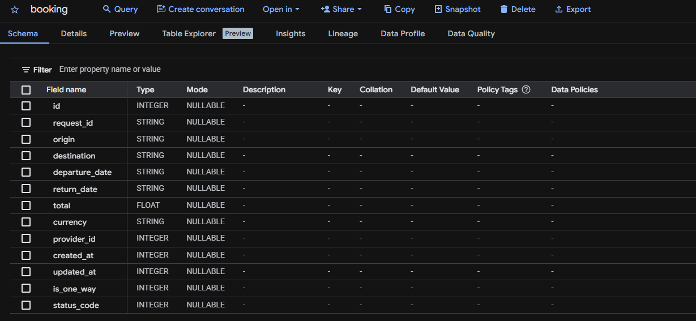


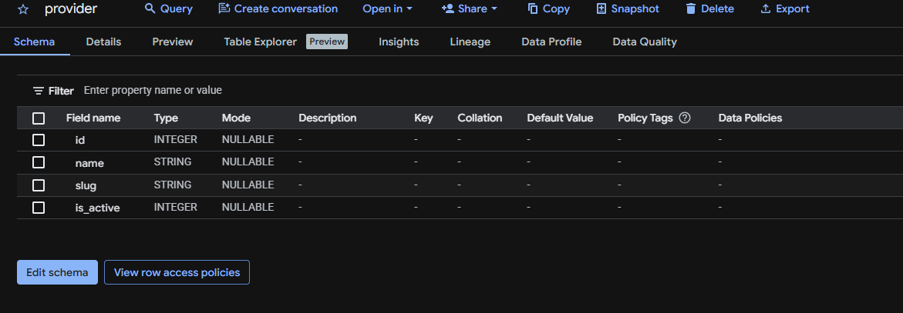


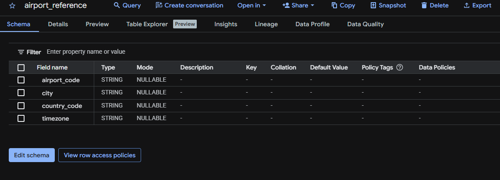


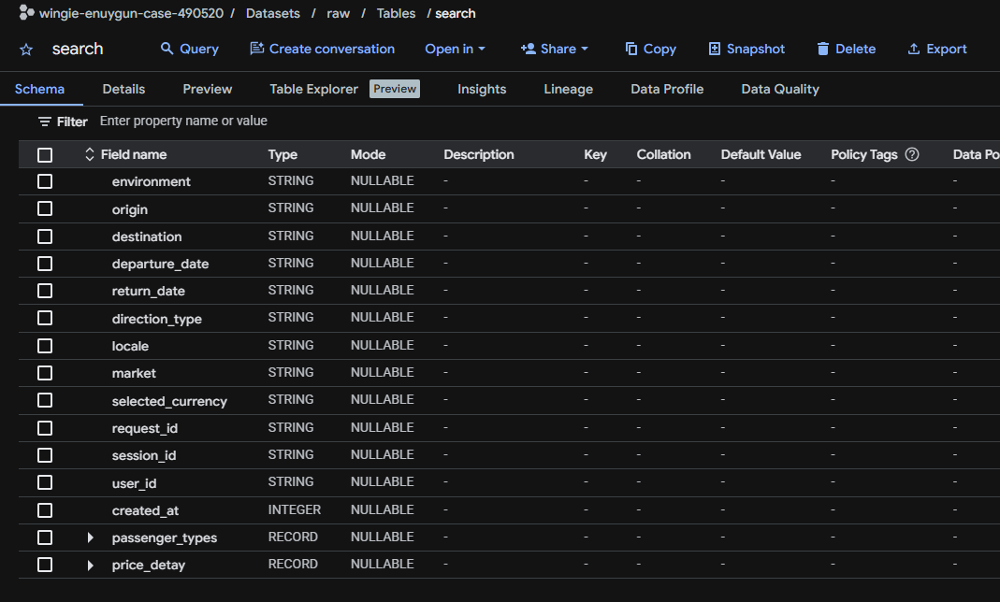

### EXAMPLE PREVIEW
### 
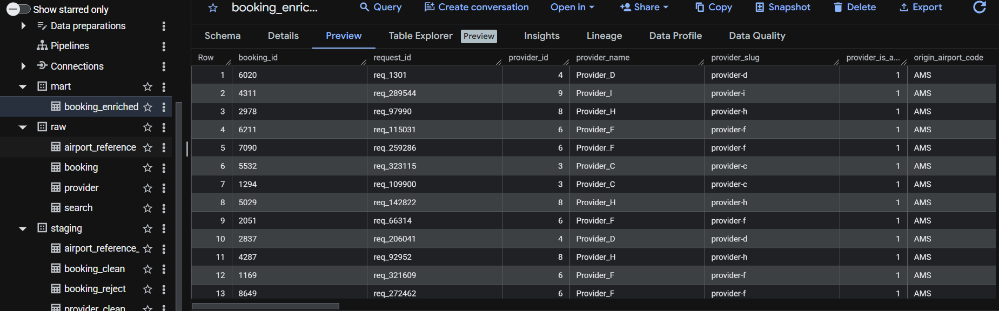

### GENERAL 
### Screenshot 01
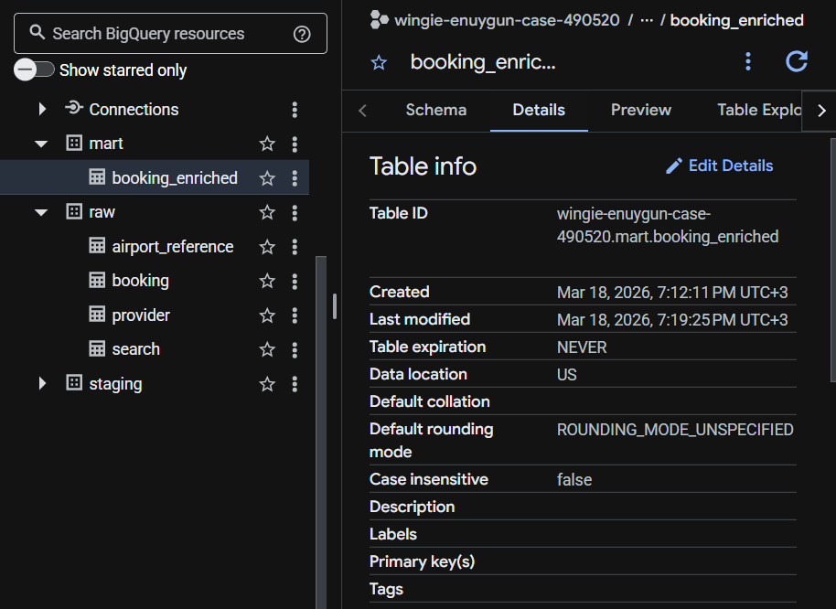

### Screenshot 02
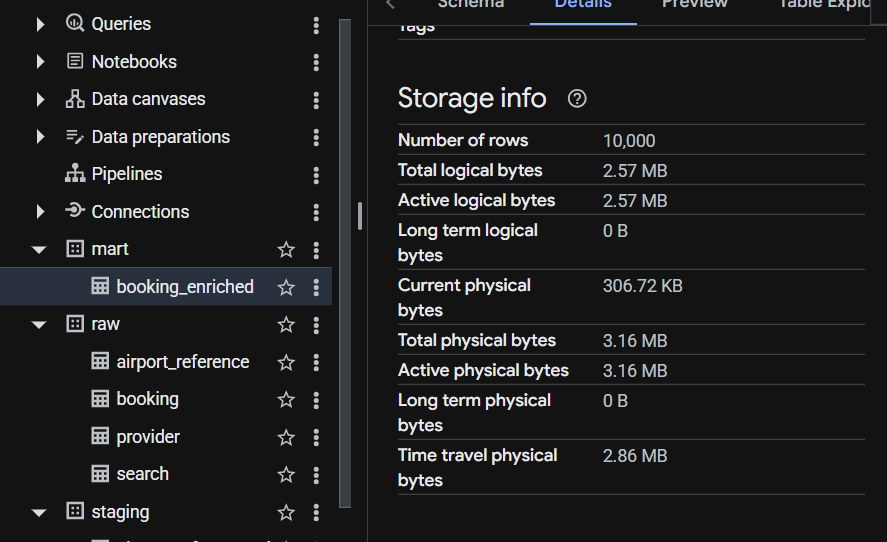

### Screenshot 03
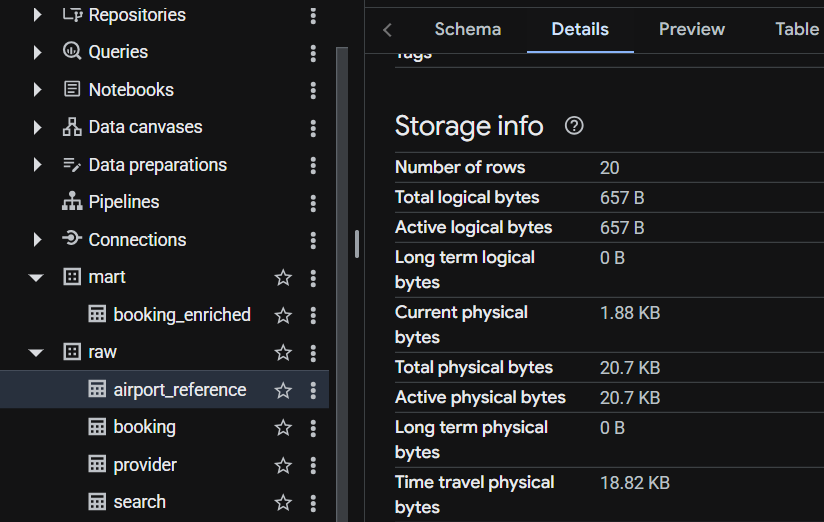

### Screenshot 04
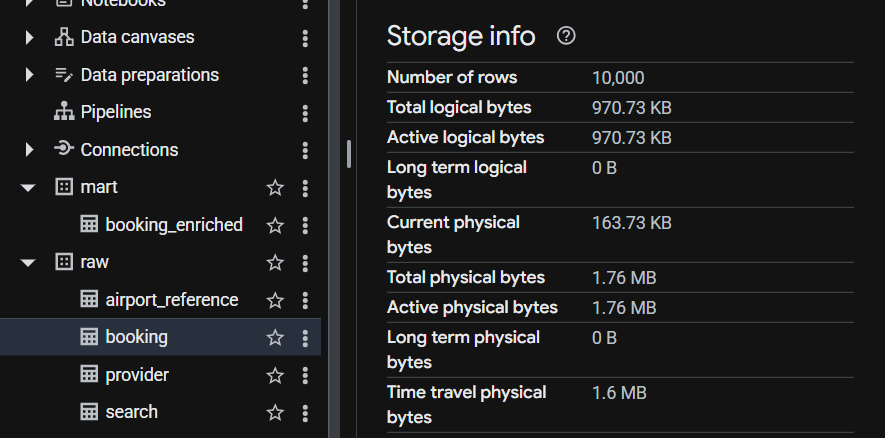

### Screenshot 05
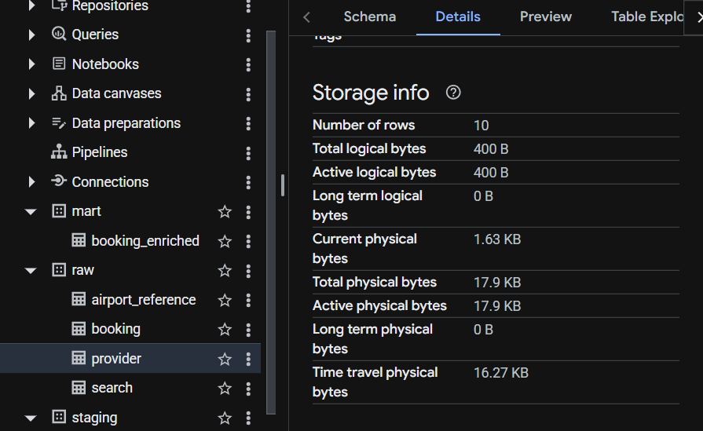

### Screenshot 06
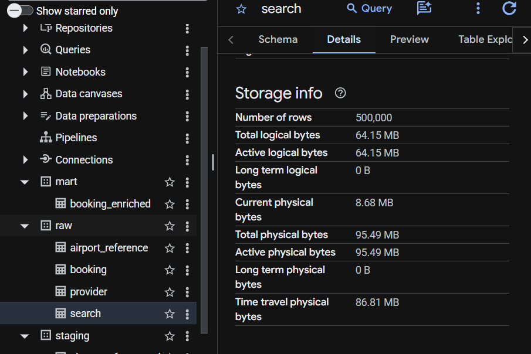

### Screenshot 07
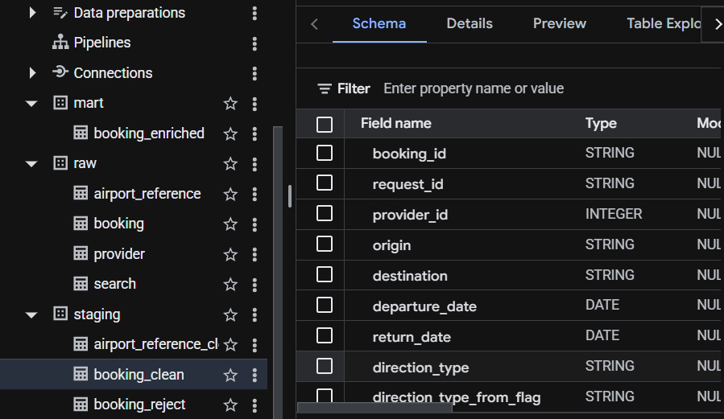

### Screenshot 08
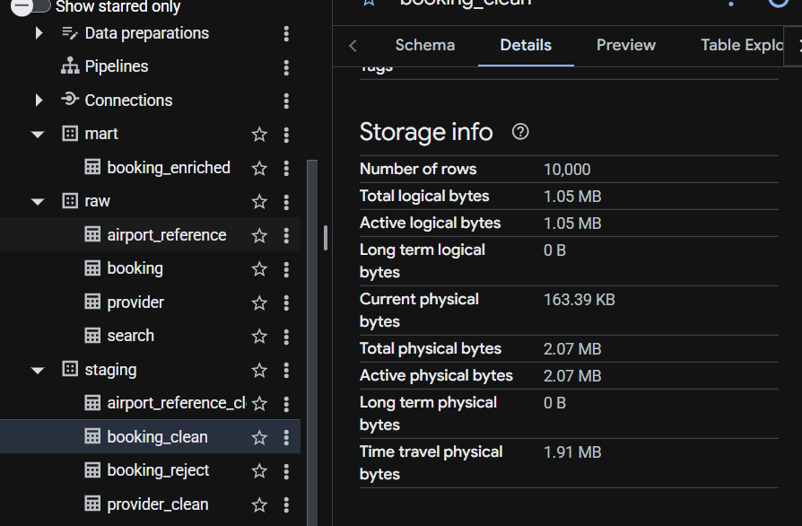

### Screenshot 09
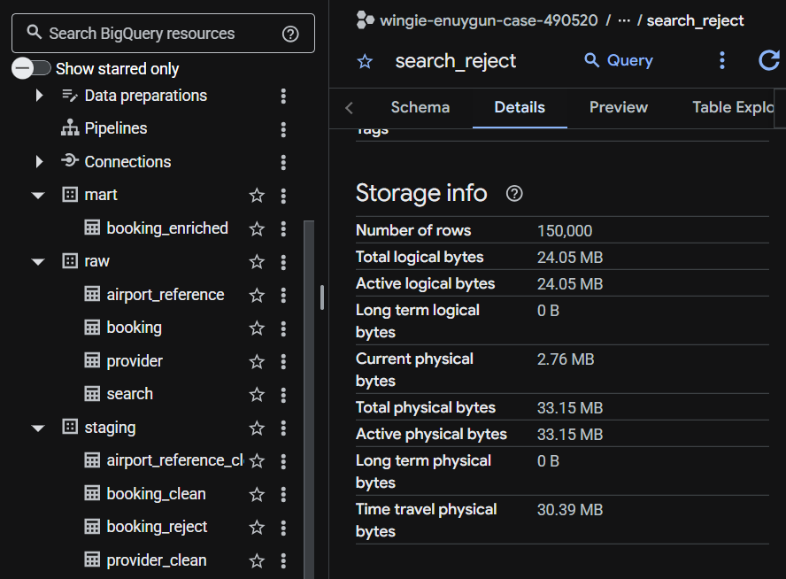

### Screenshot 10
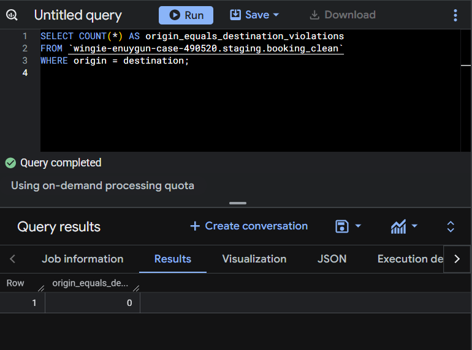

### Screenshot 11
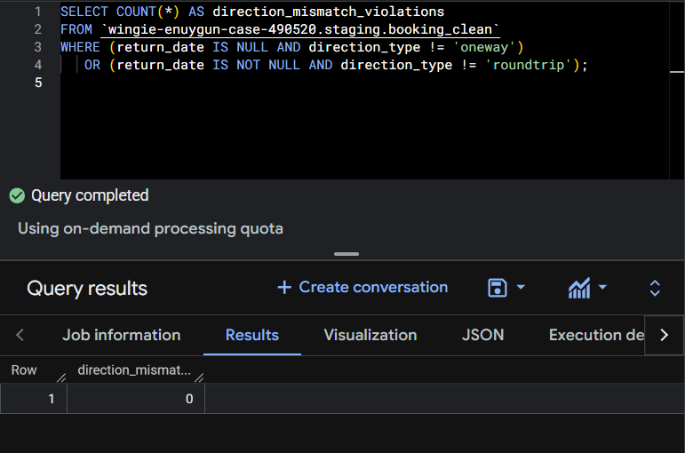

### Screenshot 12
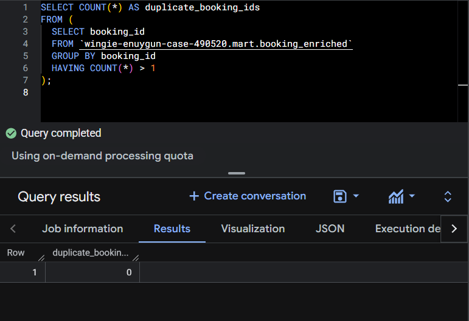

### Screenshot 13
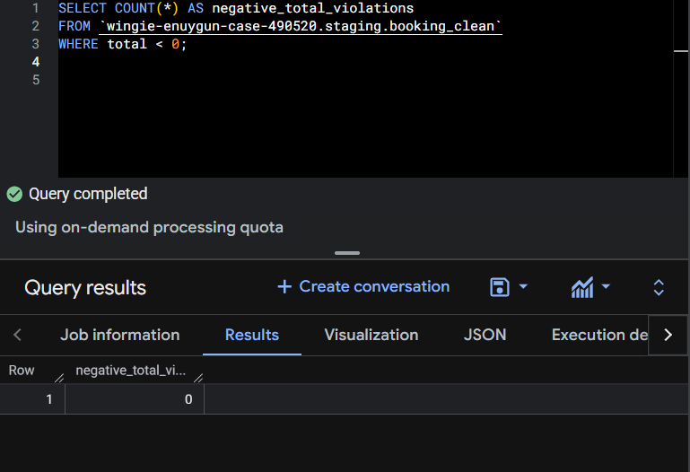

### Screenshot 14
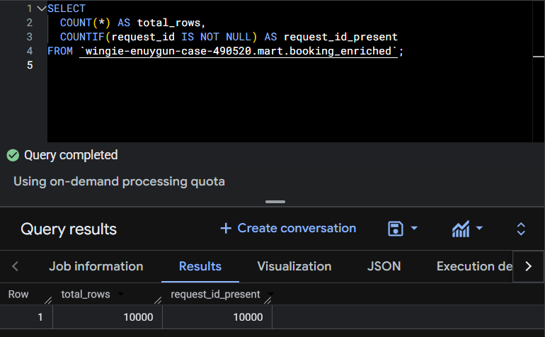

### Screenshot 15
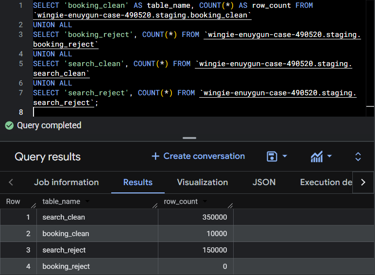


